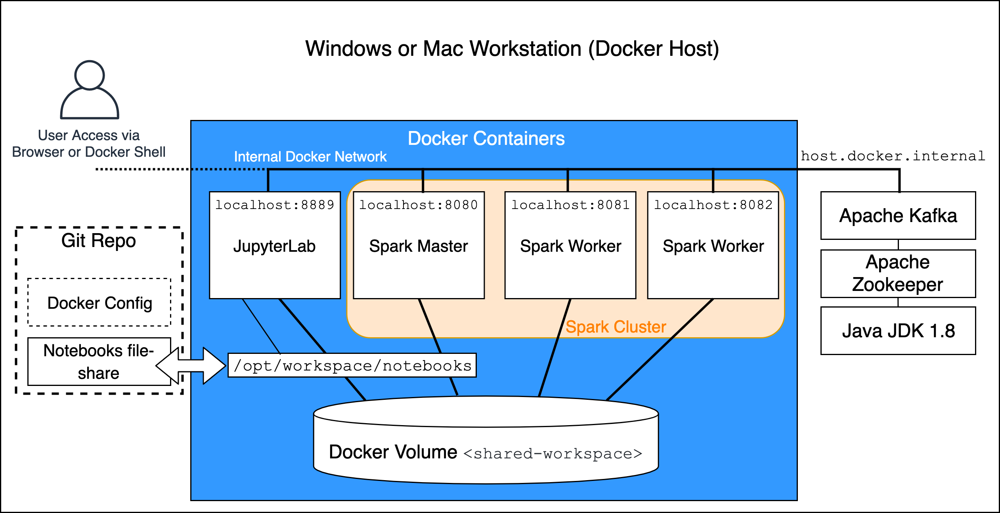

# Docker Spark + Pandas + PostgreSQL

Spark and Kafka in Docker Cluster

Run a Kafka and Spark on a Mac or Windows workstation or laptop.

The Spark cluster build is based on the following article: https://towardsdatascience.com/apache-spark-cluster-on-docker-ft-a-juyterlab-interface-418383c95445 written by @dekoperez and then extended to include Spark Streaming with PySpark compatibility and PySpark UDF execution on the worker nodes. The build has also been updated to include a working Spark history service. The Python packages numpy, pandas and matplotlib have been added to the JupyterLab docker file - this increases the size of the image.

A two-node cluster and a spark master are built as Docker images along with a separate JupyterLab environment. Each runs in a separate container and shares a network and shared file-system.

Spark and Hadoop Configuration and Release Information
Spark Version 2.4.5, Hadoop version is 2.7, Python version 3.7.3.

Apache Spark is running in Standalone Mode and controls its own master and worker nodes instead of Yarn managing them.

Apache Spark with Apache Hadoop support is used to allow the cluster to simulate HDFS distributed filesystem using the shared volume shared-workspace.



## Setup
Ensure that the Docker environment has enough memory allocated:

Configure a minimum of 4GB in Docker Resources, ideally 8GB
Build the images with
```bash
build.sh
``` 

Create the Docker volumes before starting services:
```bash
docker volume create --name=hadoop-distributed-file-system
```

Start the cluster with
```bash
docker-compose up -d
```

## Usage
Access http://127.0.0.1:8889 to start Spark notebooks
Access http://127.0.0.1:8890 to start Pandas notebooks
I've created POSTGRES database. 
Here is the information of database
```bash
POSTGRES_USER=postgres
POSTGRES_PASSWORD=postgres
POSTGRES_DB=postgres
PORT=5432
```

##  Credit
https://github.com/edbullen/DockerSpark245
